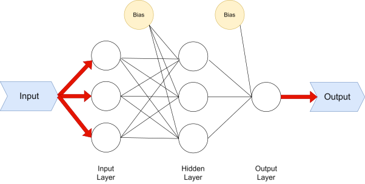

# ANN-Excel: Artificial Neural Network in Excel

ANN-Excel is a lightweight regression-oriented neural network framework implemented entirely in Microsoft Excel using VBA. It allows users to train and evaluate neural networks without any external libraries or programming knowledge.

## Features

- Single-hidden-layer Feedforward ANN for regression task support
- Built-in backpropagation with sigmoid activation

- User-configurable training/test splits, neuron counts, and epochs
- Min-Max and MaxAbs feature scaling options
- Built-in chart generation for result visualization
- No external dependencies needed

## Basic Description

1. Paste data on **Data** tab.
    - First row is for the name of each column.
    - The last column should be dependent variable. Column 1 to (last - 1) for independent variables.
    - Optionally, if there are missing data records, delete those records.
2. Count the number of data records (rows). That excludes the first row which is used for column names.
3. Click **Ctrl-Shift-A** on Data tab and select scaling method. Then, you will see a new tab of **ANN** with scaled data between 0 to 1.
    - Last line in ANN tab shows original maximum value of each column.
4. On ANN tab, click **Ctrl-Shift-R**. You can see the title of this software, then click ok.
5. You will see "number of training data?". Type the number of data records that were calculated in Step 2, then enter ok.
6. You will see "number of test data?". This step is optionally for testing/predicting additional records once ANN model is fully trained. Otherwise, just type 0, then enter ok.
7. You will see "number of input variables?". Type the number of independent variables, then enter ok.
8. You will see "maximum epoch?". Initially, try between 1,000 ~ 100,000.
    - If you type bigger number, you will get better result in terms of R^2 or RMSE. But, better result is not always good because it may cause overfitting issue.
9. You will see original dependent values in second column and ANN-calculated results in third column after executing program in **Result** sheet.
10. You can compare these observed and calculated values by plotting it using X-Y chart. Also, you can add R-square value using Excel graph function (trend lines).
    - If you want to progress Step 10. automatically, Click **Ctrl-G**.

## License

This software is distributed under the **GNU GPLv3** license.  
Please note: third-party contributions may be subject to separate copyright terms.

## Authors and Contact Information

Author: Jaehyeong Lee, Yourim Yoon, Zong Woo Geem.  
If you need any help, feel free to contact Zong Woo Geem; zwgeem@gmail.com.
